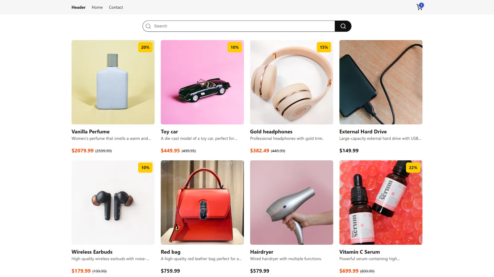

# Javascript Frameworks



## Description

In this project, you will find an ecommerce website selling a range of different items. This was my first project using React and Zustand. The website is responsive and easy to use on various devices.

**Note:** This is a school project and I do not intend to keep it updated. Feel free to use any inspiration from this project if you want.

## Built with

- [React](https://react.dev/)
- [CSS](https://developer.mozilla.org/en-US/docs/Web/CSS)
- [JavaScript](https://developer.mozilla.org/en-US/docs/Web/JavaScript)

## Getting started

You can find the live website on [Netlify](https://hyseh-javascript-frameworks.netlify.app/)

### Installing

1. Clone the repo:

```bash
git clone git@github.com:hyseh/javascript-frameworks.git
```

2. Install the dependencies:

```bash
npm install
```

### Running

To run the app, run the following commands:

```bash
npm run dev
```

## Contact

You can contact me at [john.hofland@outlook.com](mailto:john.hofland@outlook.com)
